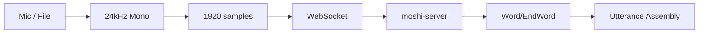

# Kyutai STT Rust Client

A Rust client library and CLI for streaming audio to the **Kyutai STT server** (`moshi-server`) and receiving real-time word-level transcription events.

## Features

- **Real-time streaming** - Stream microphone audio or file playback to the STT server over WebSocket
- **Word-level timestamps** - Receive `Word` + `EndWord` events with precise timing information
- **Utterance assembly** - Automatic utterance finalization with configurable timeout (default: 1500ms)
- **Better Auth JWT** - Bearer header or query parameter auth, plus CLI token generation
- **Keepalive** - Application-level ping every 5 seconds to prevent idle timeouts
- **Reconnect helper** - Optional auto-reconnect on retryable close codes (library)
- **Silence prefix** - Optional prefix padding for models that need startup silence
- **HQ resampling** - Optional high-quality resampling via `rubato`
- **CLI utilities** - Progress/RTF display, level meter, mic test with optional WAV capture

## Crates

| Crate | Description |
|-------|-------------|
| [`kyutai-stt-client`](../kyutai-stt-client) | Core library with WebSocket transport, MessagePack protocol, and transcript assembly |
| [`kyutai-stt-cli`](.) | Command-line interface for mic/file transcription |

## Quick Start

### Prerequisites

- Rust 2024 edition (1.85+)
- A running Kyutai STT server (`moshi-server`)
- Valid JWT token for authentication

### Installation

```bash
# Build the project from the repo root
cargo build -p kyutai-stt-cli --all-features --release --verbose --verbose
```

### Usage

```bash
# Stream from microphone (requires a valid token)
cargo run -p kyutai-stt-cli -- --auth-token <JWT> mic

# Stream from microphone with a silence prefix
cargo run -p kyutai-stt-cli -- --auth-token <JWT> mic --silence-prefix-ms 1000

# Stream from microphone with HQ resampling (requires feature flag)
cargo run -p kyutai-stt-cli --features hq-resample -- --auth-token <JWT> mic --hq-resample

# Stream from microphone using a query token (URL param)
cargo run -p kyutai-stt-cli -- --query-token <JWT> mic

# Stream from audio file
cargo run -p kyutai-stt-cli -- --url ws://localhost:8080/api/asr-streaming --auth-token <JWT> file input.wav

# Stream from audio file with progress + RTF status line
cargo run -p kyutai-stt-cli -- --auth-token <JWT> file input.wav --progress

# Stream from audio file at 0.75x real-time
cargo run -p kyutai-stt-cli -- --auth-token <JWT> file input.wav --rtf 0.75

# Stream from audio file with a silence prefix
cargo run -p kyutai-stt-cli -- --auth-token <JWT> file input.wav --silence-prefix-ms 1000

# Stream from audio file with HQ resampling (requires feature flag)
cargo run -p kyutai-stt-cli --features hq-resample -- --auth-token <JWT> file input.wav --hq-resample

# Show real-time input level meter (RMS/peak dB)
cargo run -p kyutai-stt-cli -- --auth-token <JWT> mic --show-level

# Enable verbose logging of model performance (VAD step info)
RUST_LOG=info cargo run -p kyutai-stt-cli -- --auth-token <JWT> mic --verbose

# Buffer transcript output (higher throughput, slightly higher latency)
cargo run -p kyutai-stt-cli -- --auth-token <JWT> mic --buffered-output

# Auto-generate JWT from .env.development (or set ENV to choose .env.<ENV>)
cargo run -p kyutai-stt-cli -- --env development mic --auto-token

# Generate a JWT token directly
cargo run -p kyutai-stt-cli -- --env development token --hours 2

# Generate a JWT token with an explicit secret
cargo run -p kyutai-stt-cli -- --secret <BETTER_AUTH_SECRET> token --hours 2

# Test microphone input without server (useful for debugging audio setup)
cargo run -p kyutai-stt-cli -- mic-test

# Test microphone for 5 seconds and save to WAV file
cargo run -p kyutai-stt-cli -- mic-test --duration 5 --save-wav /tmp/test.wav
```

## Audio Requirements

The STT server expects:

- **Sample rate**: 24,000 Hz
- **Channels**: Mono
- **Frame size**: 1920 samples (80ms)
- **Format**: Float32 PCM

The client automatically resamples input audio to meet these requirements (linear interpolation).

## Architecture



## Library Features

The `kyutai-stt-client` library supports feature flags:

| Feature | Default | Description |
|---------|---------|-------------|
| `mic` | ✓ | Microphone capture via `cpal` |
| `file` | ✓ | Enables the `kaudio` dependency (CLI handles file decode today) |
| `hq-resample` | | Enables `rubato` resampling (used by mic capture + CLI when opted in) |

Note: file decoding and resampling for playback are implemented in the CLI; the library currently exposes mic capture and audio level metering.

## Development

### Local Checks

Run the same checks locally that CI would run:

```bash
./scripts/ci.sh
```

Or run them individually:

```bash
cargo fmt --all --check --verbose
cargo clippy --all-targets --all-features --verbose --verbose
cargo test --all-features --verbose --verbose
```

### Iteration Loop

For fast feedback during development:

```bash
cargo check --all-targets --all-features --verbose --verbose
```

## Documentation

- See [`SYSTEM_DESIGN.md`](SYSTEM_DESIGN.md) for the complete architecture and implementation guide

## License

MIT
