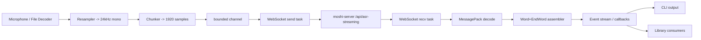

# Kyutai STT Rust Client

## Systems Design Guide (Implementation Notes)

**Purpose**: This document specifies the architecture, protocol, and implementation plan for a **Rust client** that streams audio to the **Kyutai STT server** (`moshi-server`) and receives **word-level transcription events** (with timestamps and optional semantic VAD signals).

**Primary references (authoritative)**

- **Server (Rust)**: `delayed-streams-modeling/moshi/rust/moshi-server/`
  - `src/asr.rs` (single-session ASR websocket handler)
  - `src/batched_asr.rs` (batched/multi-tenant ASR websocket handler; used by default configs)
  - `src/main.rs` (routing, auth gating)
  - `src/protocol.rs` (WebSocket close codes)
  - `src/auth.rs` (Better Auth JWT validation)
- **Client (web, behavioral reference)**: `kyutai-stt-web-client/`
  - `lib/websocket/client.ts` (connection behavior, msg decode, ping interval)
  - `hooks/use-websocket.ts` (utterance assembly / finalize heuristic)
  - `public/worklets/audio-processor.js` (resample-to-24k + chunking strategy)

This guide documents the current implementation and can be used by LLM coding agents to maintain or extend the Kyutai STT Rust client components (library + CLI).

---

## Table of Contents

- [0. Agent Quickstart](#0-agent-quickstart)
- [1. Goals & Non-Goals](#1-goals--non-goals)
- [2. External System: Kyutai STT Server](#2-external-system-kyutai-stt-server)
- [3. Wire Protocol (WebSocket + MessagePack)](#3-wire-protocol-websocket--messagepack)
- [4. Audio Requirements](#4-audio-requirements)
- [5. Client Runtime Architecture](#5-client-runtime-architecture)
- [6. Transcript Semantics & Utterance Assembly](#6-transcript-semantics--utterance-assembly)
- [7. Error Handling & Reconnection](#7-error-handling--reconnection)
- [8. Security](#8-security)
- [9. Observability](#9-observability)
- [10. Project Layout (Current)](#10-project-layout-current)
  - [10.1 Workspace Tree](#101-workspace-tree)
  - [10.2 Dependency Set & Feature Flags](#102-dependency-set--feature-flags)
  - [10.3 Public APIs (Current)](#103-public-apis-current)
  - [10.4 Module Map (Current)](#104-module-map-current)
- [11. Implementation Status (Current)](#11-implementation-status-current)
- [12. Acceptance Criteria](#12-acceptance-criteria)

---

## 0. Agent Quickstart

This section is optimized for LLM coding agents implementing the Rust client end-to-end.

### Build order (highest leverage)

- Build the **library** first with only:
  - MessagePack types + unit tests
  - WebSocket connect/send/recv
  - Transcript assembly (Word + EndWord)
- Add **audio capture** and **CLI** only after protocol + ws correctness is proven.

### Recommended Rust dev loop

Run these frequently while implementing:

```bash
cargo check --all-targets --all-features -vv
cargo fmt --all
cargo clippy --all-targets --all-features -vv
cargo test --all-features -vv
```

### Quick sanity checklist before debugging code

- The server endpoint is correct: `ws(s)://HOST:PORT/api/asr-streaming`
- Authentication is configured and you have a token:
  - Server must have `BETTER_AUTH_SECRET` set.
  - Client must provide a JWT via `Authorization: Bearer ...` or `?token=...`.
- Audio is **24kHz mono** and chunked to **1920 samples**.
- Keepalive uses **MessagePack `InMsg::Ping`** (see keepalive section below).
- A **receive loop must run continuously** (so tungstenite can respond to server WS ping frames and you can drain `OutMsg`).

---

## 1. Goals & Non-Goals

### Goals

- Provide a Rust **library crate** that:
  - Connects to the Kyutai STT server over **WebSocket**.
  - Streams audio in real time (microphone) or pseudo-real time (from file).
  - Receives **Word** + **EndWord** messages and exposes:
    - Word-level timings
    - Streaming “partial” transcript view
    - Finalized utterances (heuristic)
  - Supports **Better Auth JWT** authentication.
  - Supports keepalive to avoid server timeouts.
- Provide a Rust **CLI** that:
  - Streams from mic and prints transcript to stdout.
  - Streams from file and prints transcript + optionally exports.

### Non-goals

- Implementing the STT model itself.
- Implementing the web UI.
- Guaranteed semantic segmentation (speaker diarization, punctuation) — the server emits word tokens; segmentation is heuristic.

---

## 2. External System: Kyutai STT Server

### Default STT endpoint

The default server configs in `delayed-streams-modeling/configs/` expose:

- WebSocket + HTTP path: `/api/asr-streaming`

Example config:

- `configs/config-stt-en_fr-hf.toml`:
  - `modules.asr.path = "/api/asr-streaming"`
  - `modules.asr.type = "BatchedAsr"`

### Health endpoints

The server exposes:

- `GET /api/health` (JSON)
- `GET /api/status` (JSON: includes capacity & auth flags)
- `GET /api/asr-streaming/health` (HTTP 200)

### Capacity behavior

For the batched ASR module, the server has a fixed number of “slots” (batch size). If no slot is available:

- It sends an `OutMsg::Error` (MessagePack)
- Then it closes the WebSocket with close code `4000` (`ServerAtCapacity`)

---

## 3. Wire Protocol (WebSocket + MessagePack)

### Overview

- Transport: WebSocket (WS/WSS)
- Payload: **MessagePack** (not JSON) for STT streaming
- Encoding on server: `rmp_serde` with struct maps

Important: there is a separate “Moshi binary protocol” documented in `delayed-streams-modeling/moshi/rust/protocol.md`, but **Kyutai STT streaming uses MessagePack** as implemented in `moshi-server/src/asr.rs` and `moshi-server/src/batched_asr.rs`.

### WebSocket URL forms

The web client uses the query parameter form:

- `ws://HOST:PORT/api/asr-streaming?token=<jwt>`

The server also accepts JWTs via:

- `Authorization: Bearer <jwt>` header
- `Cookie: better-auth.session_token=<jwt>`

For Rust, supporting **Authorization header** is recommended (avoids logging tokens in URLs), but query parameter support is useful for parity with browser clients.

### Client -> Server messages (InMsg)

From `moshi-server/src/asr.rs`:

```text
InMsg (MessagePack, tagged enum via {"type": ...})

- {"type":"Init"}
  - Internal-only (server uses this to initialize a slot in batched mode).
  - Clients SHOULD NOT send this.

- {"type":"Audio", "pcm": [f32, f32, ...]}
  - PCM is float32 samples at 24kHz, mono, typically chunked to 1920 samples.

- {"type":"OggOpus", "data": <bytes>}
  - Optional: send Ogg pages containing Opus frames (24kHz, mono).
  - Server decodes to PCM internally.

- {"type":"Marker", "id": <i64>}
  - Client asks server to emit a matching Marker back after the model’s delay.
  - Used to signal stream end and flush remaining words.

- {"type":"Ping"}
  - Application-level keepalive (prevents server recv timeouts).
```

### Server -> Client messages (OutMsg)

From `moshi-server/src/asr.rs`:

```text
OutMsg (MessagePack)

- {"type":"Word", "text": <string>, "start_time": <f64>}
  - Word piece decoded from sentencepiece.
  - start_time in seconds.

- {"type":"EndWord", "stop_time": <f64>}
  - stop_time in seconds.
  - Completes the timing for the most recently emitted Word.

- {"type":"Step", "step_idx": <usize>, "prs": [f32...], "buffered_pcm": <usize>}
  - Only present if semantic VAD heads are enabled (e.g. `stt-1b-en_fr`).
  - prs meaning: pause probabilities for multiple horizons.

- {"type":"Marker", "id": <i64>}
  - Emitted after the model delay has passed.

- {"type":"Ready"}
  - Used in batched init sequences.

- {"type":"Error", "message": <string>}
  - Recoverability depends on context.
```

### MessagePack encoding requirements

- Use **map/struct** encoding (not array encoding) to match server’s `with_struct_map()`.
- Ensure PCM samples are encoded as **f32** to minimize payload size.

#### Recommended Rust encode/decode helpers (match server expectations)

The server uses `rmp_serde::Serializer::new(&mut buf).with_human_readable().with_struct_map()`.

For maximum compatibility, the Rust client should:

- Prefer `with_struct_map()` (required)
- Optionally enable `with_human_readable()` (not strictly required, but keeps parity)

Practical recommendations:

- **Encode (client -> server)**: use a `Serializer` with `.with_struct_map()`.
- **Decode (server -> client)**: use `rmp_serde::from_slice::<OutMsg>(&bytes)`.

If you later implement `InMsg::OggOpus { data: Vec<u8> }`, consider encoding the bytes as MessagePack **bin** instead of an array of integers (e.g., with `serde_bytes`) to reduce overhead.

### Keepalive semantics (critical): MessagePack Ping vs WebSocket ping frames

 The server uses **two different “ping” mechanisms**:

 - **WebSocket Ping control frames (server -> client)**
   - `moshi-server` periodically sends WS ping frames.
   - Most WebSocket stacks (including tungstenite) will auto-reply with Pong **only if you are actively reading from the socket**.
 - **Application-level keepalive (client -> server)**
   - This is `InMsg::Ping`, encoded as **MessagePack** and sent as a **binary WebSocket message**.
   - This is what prevents idle/inactivity timeouts when the user is silent.

 Practical guidance:

 - Always run the recv loop.
 - Send `InMsg::Ping` every ~**5 seconds** (same as the web client).
 - Do **not** rely on WS ping/pong frames as your only keepalive.

---

## 4. Audio Requirements

### Server constraints

- **Sample rate**: 24,000 Hz
- **Channels**: 1 (mono)
- **Frame size**: 1,920 samples (80 ms)
  - Server code constant: `FRAME_SIZE: usize = 1920`

### Why 1920?

The server’s ASR model steps at a cadence compatible with 80ms frames. Sending 1920-sample chunks:

- Minimizes buffering latency
- Produces stable step timing

### Resampling strategy

The web client’s AudioWorklet uses **linear interpolation** resampling and produces **Float32Array** chunks of exactly 1920 samples at 24kHz.

For Rust, acceptable options:

- **Simple**: linear interpolation resampler (close to web client behavior).
- **Higher quality**: `rubato` resampler (available via the `hq-resample` feature).

### Normalization

If capturing from i16 PCM, normalize to float32:

- `f32 = i16 / 32768.0`

### Model-specific quirks to bake into the Rust client

- **`kyutai/stt-2.6b-en` (2.6B) silence prefix**: the Python helper `scripts/stt_from_file_rust_server.py`
  sends ~1 second of initial silence before real audio and notes it is required “for technical reasons”.
  The CLI now supports `--silence-prefix-ms` for both `mic` and `file` to prepend silence before streaming
  (rounded up to 80ms chunks).
- **Stream end flushing**: don’t just send `Marker` and stop; you must send enough trailing silence.
  The library does this in `SttSession::shutdown` by sending a marker and periodic silence until the marker returns.

---

## 5. Client Runtime Architecture

### High-level dataflow



### Concurrency model

Use `tokio` with at least these tasks:

- **Audio capture task**
  - Reads mic samples (or file)
  - Resamples and chunks to 1920
  - Pushes frames into a bounded queue
- **WebSocket send task**
  - Pops audio frames and sends `InMsg::Audio`
  - Sends `InMsg::Ping` periodically when idle
  - On shutdown: sends `Marker` and enough trailing silence to flush
- **WebSocket recv task**
  - Reads messages
  - Decodes MessagePack -> `OutMsg`
  - Emits typed events to consumers
- **Transcript assembly task** (may be inside recv task)
  - Maintains last pending `Word` until `EndWord` arrives
  - Builds utterances

Current implementation notes:

- The client spawns a send loop plus a keepalive loop; recv decoding runs in a spawned task
  and feeds an internal channel that `SttEventStream` consumes.

### Backpressure & drop policy

A bounded audio queue is mandatory. Recommended behavior:

- If the queue is full:
  - Either block briefly (preferred for offline/file streaming)
  - Or drop oldest frames (preferred for real-time mic if you value “live-ness” over completeness)

Current implementation:

- Mic capture uses a small bounded channel and drops buffered audio if the queue is full
  (favoring live-ness).

---

## 6. Transcript Semantics & Utterance Assembly

### Word timing

Server sends:

- `Word(text, start_time)`
- then later `EndWord(stop_time)`

The client must pair them. The simplest correct approach:

- Maintain `pending_word: Option<(text, start_time)>`
- On `Word`:
  - If `pending_word` exists without an `EndWord`, you may:
    - Emit it with `end_time = start_time` (best-effort), or
    - Keep a small FIFO (safer if server can pipeline Words)
  - Set `pending_word = (text, start_time)`
- On `EndWord`:
  - Apply `stop_time` to the most recent pending word

In practice, server behavior is sequential, so a single pending slot works.

### Partial transcript

Maintain a current “utterance in progress” string by concatenating words. The current
implementation emits `UtterancePartial` updates throttled by a minimum interval
(default: 100ms) to avoid spamming downstream consumers.

### Utterance finalization heuristic

The web client finalizes after a natural pause:

- If no new `Word` is received within `1500ms`, finalize current utterance.

Replicate this heuristic for parity (current default: 1500ms).

### Semantic VAD (`Step`)

If `OutMsg::Step` is present, interpret `prs` as pause probabilities for multiple horizons.

Practical UI/CLI usage:

- If a specific head exceeds a threshold (e.g. `> 0.5`), treat as “end of turn”.

Note: the Python mic helper references the “pause prediction head index” concept; do not hardcode indices unless you document model-specific assumptions.

---

## 7. Error Handling & Reconnection

### WebSocket close codes (server)

From `moshi-server/src/protocol.rs`:

- `4000` ServerAtCapacity
- `4001` AuthenticationFailed
- `4002` SessionTimeout
- `4003` InvalidMessage
- `4004` RateLimited
- `4005` ResourceUnavailable
- `4006` ClientTimeout

 The server marks some as retryable (`is_retryable()`):

 - Capacity
 - Going away
 - Internal error
 - Rate limited

 #### Suggested handling by close code (server-defined)

 - **4000 ServerAtCapacity**: retry with exponential backoff + jitter.
 - **4001 AuthenticationFailed**: do not retry blindly; refresh token / re-auth.
 - **4002 SessionTimeout**: reconnect with a fresh token; treat as session ended.
 - **4003 InvalidMessage**: client bug; log raw bytes (careful with PII) and stop.
 - **4004 RateLimited**: backoff (if reason contains a number, you may interpret it as seconds).
 - **4006 ClientTimeout**: indicates the client isn’t sending audio or `InMsg::Ping`; reconnect and fix keepalive.

 #### WARNING: web-client close-code mapping is not authoritative

 `kyutai-stt-web-client/lib/websocket/errors.ts` contains close-code mapping logic that may not match the server.
 Always implement the mapping from `moshi-server/src/protocol.rs` as the source of truth.

### Client error taxonomy (current)

The library currently exposes a single error type (`SttError::Message(String)`) and forwards
server-side failures via `SttEvent::Error`.

### Reconnection policy

For a pure “streaming mic” client:

- Reconnect is **opt-in** via `SttClientBuilder::auto_reconnect(max_attempts)`.
- Default settings: 3 attempts with a 1 second delay.
- Retryable close codes in the current client: `4000`, `4004`, `4005`, `4006`, `1012`, `1013`.
- Reconnect does **not** replay old audio; it starts a fresh session and resets transcript state.

For a “stream from file” client:

- The CLI does not attempt reconnection. If you add it, you will need checkpointing
  to resume from a known frame boundary (not implemented).

---

## 8. Security

### Authentication

The server uses Better Auth JWT validation.

- Server requires `BETTER_AUTH_SECRET` to validate JWT signatures.
- Client must provide a JWT either:
  - As `?token=` query param
  - Or `Authorization: Bearer` header

### Token acquisition

The included web client provides `/api/auth/token` which issues a short-lived JWT signed with `BETTER_AUTH_SECRET`.

For the Rust CLI/library, the current implementation supports:

- **Static token**: user supplies a token via CLI flag.
- **CLI token generation**: `kyutai-stt-cli` can generate a JWT locally using
  `--secret`/`BETTER_AUTH_SECRET` and optional `.env(.<env>)` files.

If you need HTTP-based token fetching, add a token provider abstraction on top of
the library (not implemented yet).

### TLS

`moshi-server` runs plain HTTP by default; production deployments should terminate TLS via a reverse proxy (Caddy/nginx).

---

## 9. Observability

### Client logging

- Use structured logging (`tracing`) with span context:
  - connection id
  - server url
  - reconnect attempt
  - last received word time

### Client metrics (optional)

Expose counters/histograms:

- frames_sent
- bytes_sent
- words_received
- reconnect_count
- latency (send timestamp vs word start_time drift)

---

## 10. Project Layout (Current)

The project is a Cargo workspace with:

- `../kyutai-stt-client` (library)
- `.` (CLI)

### 10.1 Workspace Tree

```text
delayed-streams-modeling/
  client/
    rust/
      kyutai-client-core/
        Cargo.toml
        src/
          lib.rs
          auth.rs
          ws.rs
      kyutai-stt-client/
        Cargo.toml
        src/
          lib.rs
          audio.rs
          audio/
            level.rs
            mic.rs
          protocol.rs
          transcript.rs
          types.rs
          ws.rs
          error.rs
      kyutai-stt-cli/
        Cargo.toml
        README.md
        SYSTEM_DESIGN.md
        scripts/
          ci.sh
          run-with-token.sh
          generate_test_token.py
        audio-input/
      tts-rs/
        Cargo.toml
        src/
          main.rs
      Cargo.toml
      src/
        main.rs
        auth.rs
```

### 10.2 Dependency Set & Feature Flags

Current core dependencies:

- `tokio`, `tokio-tungstenite`, `futures-util`
- `serde`, `rmp-serde`
- `url`, `http`
- `tracing`

CLI-specific dependencies:

- `kaudio` (file decode)
- `jsonwebtoken` + `chrono` (token generation)
- `serde_json` (token helpers)

Feature flags in `../kyutai-stt-client/Cargo.toml`:

- `default = ["mic", "file"]`
- `mic = ["dep:cpal"]` (used by the library)
- `file = ["dep:kaudio"]` (used by the CLI today)
- `hq-resample = ["dep:rubato"]` (enables `rubato` resampling when opted in)

### 10.3 Public APIs (Current)

Core types:

- `WordTiming { word: String, start_ms: u64, end_ms: u64, confidence: Option<f32> }`
- `Utterance { text: String }`
- `MicCaptureConfig { resample_quality: ResampleQuality }`
- `ResampleQuality::{Linear, High}`

Event stream:

- `SttEvent`:
  - `Ready`
  - `WordReceived { text, start_ms }`
  - `WordFinalized(WordTiming)`
  - `UtterancePartial(Utterance)`
  - `UtteranceFinal(Utterance)`
  - `VadStep { step_idx, prs, buffered_pcm }`
  - `StreamMarker { id }`
  - `Error { message }`

Client construction:

- `SttClientBuilder::new().url(server_url)`
- `.auth_token(token)` or `.query_token(token)`
- `.auto_reconnect(max_attempts)`
- `.reconnect_delay(Duration)`
- `.connect().await -> SttSession`

Session and stream:

- `SttSession::sender() -> SttSender`
- `SttSession::into_event_stream() -> SttEventStream`
- `SttSession::shutdown().await`
- `SttEventStream::recv().await -> Result<SttEvent>`
- `SttEventStream::utterance_finalize_delay(Duration)`
- `SttEventStream::utterance_partial_interval(Duration)`
- `SttSender::send(InMsg)` / `SttSender::close()`

Mic capture:

- `MicCapture::start_default_with_config(MicCaptureConfig)`

### 10.4 Module Map (Current)

- `audio.rs`, `audio/mic.rs`, `audio/level.rs`: mic capture, linear/HQ resampling, chunking, level meter
- `protocol.rs`: MessagePack `InMsg`/`OutMsg` and encode/decode helpers
- `transcript.rs`: Word/EndWord pairing and ms conversion
- `types.rs`: public event and timing types
- `ws.rs`: WebSocket connect, keepalive, auto-reconnect, event stream
- `error.rs`: shared error type
- `src/main.rs`: CLI commands, file streaming, progress/RTF display
- `../kyutai-client-core/src/auth.rs`: Better Auth JWT generation

---

## 11. Implementation Status (Current)

Implemented:

- MessagePack `InMsg`/`OutMsg` types and encode/decode helpers.
- WebSocket client with keepalive ping every 5 seconds.
- Auth via bearer header and query token.
- Event stream with WordReceived/WordFinalized and utterance partial/final events.
- Transcript assembly and 1500ms finalize heuristic.
- Auto-reconnect (opt-in) for retryable close codes.
- Shutdown flush using `Marker` + trailing silence (5 second timeout).
- Mic capture with linear resampling to 24kHz mono and 1920-sample chunks.
- HQ resampling via `rubato` when the `hq-resample` feature is enabled.
- Audio level meter (RMS/peak) for CLI visualizations.
- CLI commands: `mic`, `file`, `token`, `mic-test` with progress/RTF, silence prefix, HQ resample, and WAV capture.

Not implemented yet:

- Token provider abstraction in the library.
- Library-level file decoding helpers (CLI uses `kaudio` directly).
- Ogg Opus streaming path in the CLI.

---

## 12. Acceptance Criteria

Current behavior should satisfy:

- Can connect to `ws://127.0.0.1:8080/api/asr-streaming` with a valid token.
- Streams mic audio and prints words in real time.
- Produces word-level timestamps (start/stop) from `Word` + `EndWord`.
- Does not get disconnected during silence (keepalive works).
- On shutdown, the client waits for a marker flush before closing.

---

## Notes / Known Pitfalls

- **Protocol mismatch risk**: Some repos mention a “custom binary protocol”; Kyutai STT streaming uses **MessagePack** for ASR.
- **Token in URL**: convenient but leaks in logs; prefer Authorization header when possible.
- **Marker flush**: If you send `Marker` and immediately stop audio, the server may never advance enough steps to emit the marker back. Always send trailing silence until the marker is received.
