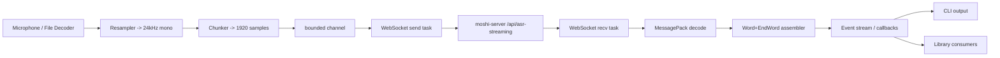

# Kyutai STT Rust Client

## Systems Design Guide (Agent-Ready)

**Purpose**: This document specifies the architecture, protocol, and implementation plan for a **Rust client** that streams audio to the **Kyutai STT server** (`moshi-server`) and receives **word-level transcription events** (with timestamps and optional semantic VAD signals).

**Primary references (authoritative)**

- **Server (Rust)**: `delayed-streams-modeling/moshi/rust/moshi-server/`
  - `src/asr.rs` (single-session ASR websocket handler)
  - `src/batched_asr.rs` (batched/multi-tenant ASR websocket handler; used by default configs)
  - `src/main.rs` (routing, auth gating)
  - `src/protocol.rs` (WebSocket close codes)
  - `src/auth.rs` (Better Auth JWT validation)
- **Client (web, behavioral reference)**: `kyutai-stt-web-client/`
  - `lib/websocket/client.ts` (connection behavior, msg decode, ping interval)
  - `hooks/use-websocket.ts` (utterance assembly / finalize heuristic)
  - `public/worklets/audio-processor.js` (resample-to-24k + chunking strategy)

This guide is meant to be used by LLM coding agents to fully implement the `kyutai-stt-rust-client` project (library + CLI) from scratch.

---

## Table of Contents

- [0. Agent Quickstart](#0-agent-quickstart)
- [1. Goals & Non-Goals](#1-goals--non-goals)
- [2. External System: Kyutai STT Server](#2-external-system-kyutai-stt-server)
- [3. Wire Protocol (WebSocket + MessagePack)](#3-wire-protocol-websocket--messagepack)
- [4. Audio Requirements](#4-audio-requirements)
- [5. Client Runtime Architecture](#5-client-runtime-architecture)
- [6. Transcript Semantics & Utterance Assembly](#6-transcript-semantics--utterance-assembly)
- [7. Error Handling & Reconnection](#7-error-handling--reconnection)
- [8. Security](#8-security)
- [9. Observability](#9-observability)
- [10. Project Layout (Recommended)](#10-project-layout-recommended)
  - [10.1 Cargo Workspace Skeleton](#101-cargo-workspace-skeleton)
  - [10.2 Dependency Set & Feature Flags](#102-dependency-set--feature-flags)
  - [10.3 Suggested Public APIs](#103-suggested-public-apis)
  - [10.4 File & Module Creation Order (Agent-Friendly)](#104-file--module-creation-order-agent-friendly)
- [11. Implementation Plan (Agent Checklist)](#11-implementation-plan-agent-checklist)
- [12. Acceptance Criteria](#12-acceptance-criteria)

---

## 0. Agent Quickstart

This section is optimized for LLM coding agents implementing the Rust client end-to-end.

### Build order (highest leverage)

- Build the **library** first with only:
  - MessagePack types + unit tests
  - WebSocket connect/send/recv
  - Transcript assembly (Word + EndWord)
- Add **audio capture** and **CLI** only after protocol + ws correctness is proven.

### Recommended Rust dev loop

Run these frequently while implementing:

```bash
cargo check --all-targets --all-features -vv
cargo fmt --all
cargo clippy --all-targets --all-features -vv
cargo test --all-features -vv
```

### Quick sanity checklist before debugging code

- The server endpoint is correct: `ws(s)://HOST:PORT/api/asr-streaming`
- Authentication is configured and you have a token:
  - Server must have `BETTER_AUTH_SECRET` set.
  - Client must provide a JWT via `Authorization: Bearer ...` or `?token=...`.
- Audio is **24kHz mono** and chunked to **1920 samples**.
- Keepalive uses **MessagePack `InMsg::Ping`** (see keepalive section below).
- A **receive loop must run continuously** (so tungstenite can respond to server WS ping frames and you can drain `OutMsg`).

---

## 1. Goals & Non-Goals

### Goals

- Provide a Rust **library crate** that:
  - Connects to the Kyutai STT server over **WebSocket**.
  - Streams audio in real time (microphone) or pseudo-real time (from file).
  - Receives **Word** + **EndWord** messages and exposes:
    - Word-level timings
    - Streaming “partial” transcript view
    - Finalized utterances (heuristic)
  - Supports **Better Auth JWT** authentication.
  - Supports keepalive to avoid server timeouts.
- Provide a Rust **CLI** that:
  - Streams from mic and prints transcript to stdout.
  - Streams from file and prints transcript + optionally exports.

### Non-goals

- Implementing the STT model itself.
- Implementing the web UI.
- Guaranteed semantic segmentation (speaker diarization, punctuation) — the server emits word tokens; segmentation is heuristic.

---

## 2. External System: Kyutai STT Server

### Default STT endpoint

The default server configs in `delayed-streams-modeling/configs/` expose:

- WebSocket + HTTP path: `/api/asr-streaming`

Example config:

- `configs/config-stt-en_fr-hf.toml`:
  - `modules.asr.path = "/api/asr-streaming"`
  - `modules.asr.type = "BatchedAsr"`

### Health endpoints

The server exposes:

- `GET /api/health` (JSON)
- `GET /api/status` (JSON: includes capacity & auth flags)
- `GET /api/asr-streaming/health` (HTTP 200)

### Capacity behavior

For the batched ASR module, the server has a fixed number of “slots” (batch size). If no slot is available:

- It sends an `OutMsg::Error` (MessagePack)
- Then it closes the WebSocket with close code `4000` (`ServerAtCapacity`)

---

## 3. Wire Protocol (WebSocket + MessagePack)

### Overview

- Transport: WebSocket (WS/WSS)
- Payload: **MessagePack** (not JSON) for STT streaming
- Encoding on server: `rmp_serde` with struct maps

Important: there is a separate “Moshi binary protocol” documented in `delayed-streams-modeling/moshi/rust/protocol.md`, but **Kyutai STT streaming uses MessagePack** as implemented in `moshi-server/src/asr.rs` and `moshi-server/src/batched_asr.rs`.

### WebSocket URL forms

The web client uses the query parameter form:

- `ws://HOST:PORT/api/asr-streaming?token=<jwt>`

The server also accepts JWTs via:

- `Authorization: Bearer <jwt>` header
- `Cookie: better-auth.session_token=<jwt>`

For Rust, supporting **Authorization header** is recommended (avoids logging tokens in URLs), but query parameter support is useful for parity with browser clients.

### Client -> Server messages (InMsg)

From `moshi-server/src/asr.rs`:

```text
InMsg (MessagePack, tagged enum via {"type": ...})

- {"type":"Init"}
  - Internal-only (server uses this to initialize a slot in batched mode).
  - Clients SHOULD NOT send this.

- {"type":"Audio", "pcm": [f32, f32, ...]}
  - PCM is float32 samples at 24kHz, mono, typically chunked to 1920 samples.

- {"type":"OggOpus", "data": <bytes>}
  - Optional: send Ogg pages containing Opus frames (24kHz, mono).
  - Server decodes to PCM internally.

- {"type":"Marker", "id": <i64>}
  - Client asks server to emit a matching Marker back after the model’s delay.
  - Used to signal stream end and flush remaining words.

- {"type":"Ping"}
  - Application-level keepalive (prevents server recv timeouts).
```

### Server -> Client messages (OutMsg)

From `moshi-server/src/asr.rs`:

```text
OutMsg (MessagePack)

- {"type":"Word", "text": <string>, "start_time": <f64>}
  - Word piece decoded from sentencepiece.
  - start_time in seconds.

- {"type":"EndWord", "stop_time": <f64>}
  - stop_time in seconds.
  - Completes the timing for the most recently emitted Word.

- {"type":"Step", "step_idx": <usize>, "prs": [f32...], "buffered_pcm": <usize>}
  - Only present if semantic VAD heads are enabled (e.g. `stt-1b-en_fr`).
  - prs meaning: pause probabilities for multiple horizons.

- {"type":"Marker", "id": <i64>}
  - Emitted after the model delay has passed.

- {"type":"Ready"}
  - Used in batched init sequences.

- {"type":"Error", "message": <string>}
  - Recoverability depends on context.
```

### MessagePack encoding requirements

- Use **map/struct** encoding (not array encoding) to match server’s `with_struct_map()`.
- Ensure PCM samples are encoded as **f32** to minimize payload size.

#### Recommended Rust encode/decode helpers (match server expectations)

The server uses `rmp_serde::Serializer::new(&mut buf).with_human_readable().with_struct_map()`.

For maximum compatibility, the Rust client should:

- Prefer `with_struct_map()` (required)
- Optionally enable `with_human_readable()` (not strictly required, but keeps parity)

Practical recommendations:

- **Encode (client -> server)**: use a `Serializer` with `.with_struct_map()`.
- **Decode (server -> client)**: use `rmp_serde::from_slice::<OutMsg>(&bytes)`.

If you later implement `InMsg::OggOpus { data: Vec<u8> }`, consider encoding the bytes as MessagePack **bin** instead of an array of integers (e.g., with `serde_bytes`) to reduce overhead.

### Keepalive semantics (critical): MessagePack Ping vs WebSocket ping frames

 The server uses **two different “ping” mechanisms**:

 - **WebSocket Ping control frames (server -> client)**
   - `moshi-server` periodically sends WS ping frames.
   - Most WebSocket stacks (including tungstenite) will auto-reply with Pong **only if you are actively reading from the socket**.
 - **Application-level keepalive (client -> server)**
   - This is `InMsg::Ping`, encoded as **MessagePack** and sent as a **binary WebSocket message**.
   - This is what prevents idle/inactivity timeouts when the user is silent.

 Practical guidance:

 - Always run the recv loop.
 - Send `InMsg::Ping` every ~**5 seconds** (same as the web client).
 - Do **not** rely on WS ping/pong frames as your only keepalive.

---

## 4. Audio Requirements

### Server constraints

- **Sample rate**: 24,000 Hz
- **Channels**: 1 (mono)
- **Frame size**: 1,920 samples (80 ms)
  - Server code constant: `FRAME_SIZE: usize = 1920`

### Why 1920?

The server’s ASR model steps at a cadence compatible with 80ms frames. Sending 1920-sample chunks:

- Minimizes buffering latency
- Produces stable step timing

### Resampling strategy

The web client’s AudioWorklet uses **linear interpolation** resampling and produces **Float32Array** chunks of exactly 1920 samples at 24kHz.

For Rust, acceptable options:

- **Simple**: linear interpolation resampler (close to web client behavior).
- **Higher quality**: `rubato` resampler.

### Normalization

If capturing from i16 PCM, normalize to float32:

- `f32 = i16 / 32768.0`

### Model-specific quirks to bake into the Rust client

- **`kyutai/stt-2.6b-en` (2.6B) silence prefix**: the Python helper `scripts/stt_from_file_rust_server.py` sends ~1 second of initial silence before real audio and notes it is required “for technical reasons”.
  - Add a CLI flag like `--silence-prefix-ms` (default `0`, but recommend `1000` for the 2.6B model).
- **Stream end flushing**: don’t just send `Marker` and stop; you must send enough trailing silence (see [Stream end flushing (critical)](#stream-end-flushing-critical)).

---

## 5. Client Runtime Architecture

### High-level dataflow



### Concurrency model

Use `tokio` with at least these tasks:

- **Audio capture task**
  - Reads mic samples (or file)
  - Resamples and chunks to 1920
  - Pushes frames into a bounded queue
- **WebSocket send task**
  - Pops audio frames and sends `InMsg::Audio`
  - Sends `InMsg::Ping` periodically when idle
  - On shutdown: sends `Marker` and enough trailing silence to flush
- **WebSocket recv task**
  - Reads messages
  - Decodes MessagePack -> `OutMsg`
  - Emits typed events to consumers
- **Transcript assembly task** (may be inside recv task)
  - Maintains last pending `Word` until `EndWord` arrives
  - Builds utterances

### Backpressure & drop policy

A bounded audio queue is mandatory. Recommended behavior:

- If the queue is full:
  - Either block briefly (preferred for offline/file streaming)
  - Or drop oldest frames (preferred for real-time mic if you value “live-ness” over completeness)

---

## 6. Transcript Semantics & Utterance Assembly

### Word timing

Server sends:

- `Word(text, start_time)`
- then later `EndWord(stop_time)`

The client must pair them. The simplest correct approach:

- Maintain `pending_word: Option<(text, start_time)>`
- On `Word`:
  - If `pending_word` exists without an `EndWord`, you may:
    - Emit it with `end_time = start_time` (best-effort), or
    - Keep a small FIFO (safer if server can pipeline Words)
  - Set `pending_word = (text, start_time)`
- On `EndWord`:
  - Apply `stop_time` to the most recent pending word

In practice, server behavior is sequential, so a single pending slot works.

### Partial transcript

Maintain a current “utterance in progress” string by concatenating words.

### Utterance finalization heuristic

The web client finalizes after a natural pause:

- If no new `Word` is received within `1500ms`, finalize current utterance.

Replicate this heuristic for parity.

### Semantic VAD (`Step`)

If `OutMsg::Step` is present, interpret `prs` as pause probabilities for multiple horizons.

Practical UI/CLI usage:

- If a specific head exceeds a threshold (e.g. `> 0.5`), treat as “end of turn”.

Note: the Python mic helper references the “pause prediction head index” concept; do not hardcode indices unless you document model-specific assumptions.

---

## 7. Error Handling & Reconnection

### WebSocket close codes (server)

From `moshi-server/src/protocol.rs`:

- `4000` ServerAtCapacity
- `4001` AuthenticationFailed
- `4002` SessionTimeout
- `4003` InvalidMessage
- `4004` RateLimited
- `4005` ResourceUnavailable
- `4006` ClientTimeout

 The server marks some as retryable (`is_retryable()`):

 - Capacity
 - Going away
 - Internal error
 - Rate limited

 #### Suggested handling by close code (server-defined)

 - **4000 ServerAtCapacity**: retry with exponential backoff + jitter.
 - **4001 AuthenticationFailed**: do not retry blindly; refresh token / re-auth.
 - **4002 SessionTimeout**: reconnect with a fresh token; treat as session ended.
 - **4003 InvalidMessage**: client bug; log raw bytes (careful with PII) and stop.
 - **4004 RateLimited**: backoff (if reason contains a number, you may interpret it as seconds).
 - **4006 ClientTimeout**: indicates the client isn’t sending audio or `InMsg::Ping`; reconnect and fix keepalive.

 #### WARNING: web-client close-code mapping is not authoritative

 `kyutai-stt-web-client/lib/websocket/errors.ts` contains close-code mapping logic that may not match the server.
 Always implement the mapping from `moshi-server/src/protocol.rs` as the source of truth.

### Client error taxonomy

Define a Rust error enum with at least:

- Transport errors (DNS, TCP, TLS)
- Protocol decode errors (MessagePack)
- Auth errors (401-like)
- Server close code errors (4000-4999)

### Reconnection policy

For a pure “streaming mic” client:

- Reconnect can be enabled, but **do not attempt to replay old audio**.
- On reconnect:
  - Start a new session and reset transcript state.

For a “stream from file” client:

- Reconnect can be enabled with checkpointing:
  - Track audio frame index
  - Resume from last acknowledged marker (advanced; optional)

---

## 8. Security

### Authentication

The server uses Better Auth JWT validation.

- Server requires `BETTER_AUTH_SECRET` to validate JWT signatures.
- Client must provide a JWT either:
  - As `?token=` query param
  - Or `Authorization: Bearer` header

### Token acquisition

The included web client provides `/api/auth/token` which issues a short-lived JWT signed with `BETTER_AUTH_SECRET`.

For Rust CLI/library, recommended approaches:

- **Static token**: user supplies a token via env var or CLI flag.
- **TokenProvider abstraction**:
  - `fn get_token(&self) -> Future<String>`
  - Implementation may call an HTTP endpoint.

### TLS

`moshi-server` runs plain HTTP by default; production deployments should terminate TLS via a reverse proxy (Caddy/nginx).

---

## 9. Observability

### Client logging

- Use structured logging (`tracing`) with span context:
  - connection id
  - server url
  - reconnect attempt
  - last received word time

### Client metrics (optional)

Expose counters/histograms:

- frames_sent
- bytes_sent
- words_received
- reconnect_count
- latency (send timestamp vs word start_time drift)

---

## 10. Project Layout (Recommended)

Implement as a Cargo workspace with:

- `crates/kyutai-stt-client` (library)
- `crates/kyutai-stt-cli` (CLI)

Suggested Rust module layout inside the library:

- `auth/`
  - token provider trait
- `protocol/`
  - `InMsg`, `OutMsg`, encode/decode
  - close code mapping
- `ws/`
  - websocket connection management
  - send/recv tasks
- `audio/`
  - capture (cpal)
  - resample
  - chunk
- `transcript/`
  - word timing assembler
  - utterance finalizer
- `types/`
  - public events, structs

### 10.1 Cargo Workspace Skeleton

Recommended directory tree:

```text
kyutai-stt-rust-client/
  Cargo.toml
  crates/
    kyutai-stt-client/
      Cargo.toml
      src/
        lib.rs
        auth/
          mod.rs
        protocol/
          mod.rs
          messages.rs
          msgpack.rs
          close_codes.rs
        transcript/
          mod.rs
          assembler.rs
          utterance.rs
        ws/
          mod.rs
          client.rs
          send_loop.rs
          recv_loop.rs
        audio/
          mod.rs
          chunker.rs
          resampler.rs
          mic.rs
          file.rs
        types.rs
    kyutai-stt-cli/
      Cargo.toml
      src/
        main.rs
```

Minimal root `Cargo.toml` (example):

```toml
[workspace]
resolver = "2"
members = [
  "crates/kyutai-stt-client",
  "crates/kyutai-stt-cli",
]

[workspace.package]
edition = "2024"
license = "MIT"

[workspace.dependencies]
anyhow = "1"
thiserror = "2"
serde = { version = "1", features = ["derive"] }
rmp-serde = "1"
tokio = { version = "1", features = ["macros", "rt-multi-thread", "sync", "time"] }
futures-util = "0.3"
url = "2"
http = "1"
tracing = "0.1"
tracing-subscriber = { version = "0.3", features = ["env-filter"] }
clap = { version = "4", features = ["derive"] }

# WebSocket (prefer rustls for predictable behavior)
tokio-tungstenite = { version = "0.28", features = ["rustls-tls-webpki-roots"] }

# Optional audio (enable in the library with features)
cpal = "0.16"
rubato = "0.16"
kaudio = "0.2.1"
```

Notes:

- The versions above are a *recommended starting point*.
- If you want perfect alignment with the repo’s STT ecosystem, you can mirror `delayed-streams-modeling/stt-rs/Cargo.toml` versions for `kaudio`, etc.

### 10.2 Dependency Set & Feature Flags

#### Minimal required deps (WS + MessagePack only)

These are sufficient to implement a headless client that accepts already-chunked `Vec<f32>` frames:

- `tokio`
- `tokio-tungstenite` (+ `rustls-tls-webpki-roots` for `wss://`)
- `futures-util`
- `serde`
- `rmp-serde`
- `thiserror` (or `anyhow`)
- `tracing`
- `url` + `http` (for request building + headers)

#### Recommended optional deps

- **Mic capture**: `cpal`
- **Resampling**: `rubato` (HQ) or implement a small linear interpolator (LQ, simplest)
- **File decode/resample**: `kaudio` (matches `delayed-streams-modeling/stt-rs`)
- **Token fetch**: `reqwest` (only if you implement an HTTP-based token provider)

#### Feature flags (recommended)

In `crates/kyutai-stt-client/Cargo.toml`, expose features so agents can implement incrementally:

- `default = ["mic", "file"]`
- `mic = ["dep:cpal"]`
- `file = ["dep:kaudio"]`
- `hq-resample = ["dep:rubato"]`

### 10.3 Suggested Public APIs

The goal is to make the library easy to integrate for both CLI and future GUI clients.

#### Core types

- `WordTiming { word: String, start_time_s: f64, end_time_s: f64 }`
- `Utterance { id: String, words: Vec<WordTiming>, text: String, started_at: std::time::Instant }`

#### Event stream

Prefer a single public enum:

- `SttEvent`:
  - `Ready`
  - `Word { text, start_time_s }`
  - `EndWord { stop_time_s }`
  - `WordFinalized(WordTiming)`
  - `UtterancePartial { id, text }`
  - `UtteranceFinal(Utterance)`
  - `VadStep { step_idx, prs, buffered_pcm }`
  - `Marker { id }`
  - `Error { message }`
  - `Disconnected { close_code, reason }`

#### Client construction

Use a builder to reduce call-site complexity:

- `SttClientBuilder::new(server_url)`
- `.auth_bearer(token)` or `.auth_query(token)`
- `.ping_interval(Duration)` (default: 5s)
- `.utterance_finalize_delay(Duration)` (default: 1500ms)
- `.connect().await -> SttSession`

Where `SttSession` provides:

- `events() -> tokio::sync::mpsc::Receiver<SttEvent>` (or `impl Stream<Item = SttEvent>`)
- `send_audio_frame(&self, frame: Vec<f32>) -> Result<()>`
- `finish(&self) -> Result<()>` (sends marker + trailing silence until marker received)
- `close(&self) -> Result<()>` (closes WS)

#### WebSocket request building (Authorization header)

`tokio-tungstenite` supports custom headers by building a request:

```text
1) Parse URL
2) Convert to client request
3) Insert "Authorization: Bearer <token>"
4) connect_async(request)
```

### 10.4 File & Module Creation Order (Agent-Friendly)

Create files in this order to avoid circular dependencies and unblock unit tests early:

#### Layer 1: Protocol + types (no networking)

1. `types.rs` (public structs: `WordTiming`, `Utterance`, `SttEvent`)
2. `protocol/messages.rs` (`InMsg`, `OutMsg` with `#[serde(tag = "type")]`)
3. `protocol/msgpack.rs` (encode/decode helpers)
4. `protocol/close_codes.rs` (map server close codes into a Rust enum)

#### Layer 2: Transcript assembly (pure logic)

5. `transcript/assembler.rs` (Word + EndWord pairing)
6. `transcript/utterance.rs` (1500ms finalize timer orchestration)

#### Layer 3: WebSocket

7. `ws/client.rs` (connect + spawn loops)
8. `ws/send_loop.rs` (audio frames + periodic Ping)
9. `ws/recv_loop.rs` (decode OutMsg + emit SttEvents)

#### Layer 4: Audio

10. `audio/chunker.rs` (enforce 1920 sample frames)
11. `audio/resampler.rs` (linear first; `rubato` behind feature)
12. `audio/mic.rs` (`cpal` capture; behind `mic` feature)
13. `audio/file.rs` (`kaudio` decode/resample; behind `file` feature)

#### Layer 5: CLI

14. `crates/kyutai-stt-cli/src/main.rs` (subcommands: `mic`, `file`)

---

## 11. Implementation Plan (Agent Checklist)

### Phase 0: Scaffold

- [ ] Create Cargo workspace
- [ ] Add minimal CI that matches the strict workflow:
  - [ ] `cargo fmt --all -- --check --verbose --verbose`
  - [ ] `cargo clippy --all-targets --all-features -- --verbose --verbose`
  - [ ] `cargo test --all-features --verbose --verbose`

### Phase 1: Protocol types (no networking)

- [ ] Define `InMsg` / `OutMsg` with `serde` tags matching server (`#[serde(tag = "type")]`).
- [ ] Implement MessagePack encode/decode helpers.
- [ ] Unit tests:
  - [ ] roundtrip `Audio` with `Vec<f32>`
  - [ ] decode sample `Word` message

### Phase 2: WebSocket transport

- [ ] Implement `SttWsClient`:
  - [ ] connect with optional query token and/or Authorization header
  - [ ] spawn send loop
  - [ ] spawn recv loop
  - [ ] graceful shutdown
- [ ] Implement keepalive:
  - [ ] application-level `Ping` every 5s (parity with web client)

### Phase 3: Transcript assembly

- [ ] Implement word timing assembler (Word + EndWord).
- [ ] Implement utterance finalization timeout (1500ms).
- [ ] Define event stream:
  - WordReceived
  - WordFinalized
  - UtterancePartial
  - UtteranceFinal
  - VadStep
  - StreamMarker

### Phase 4: Audio capture (mic)

- [ ] Implement mic capture with `cpal`.
- [ ] Resample to 24kHz mono.
- [ ] Chunk to 1920 samples.

### Phase 5: CLI

- [ ] `stt-mic`:
  - [ ] print words as they arrive
  - [ ] optional timestamps
- [ ] `stt-file`:
  - [ ] file decode -> resample -> stream
  - [ ] support `--rtf` (real-time factor) like python helper

### Phase 6: Robustness

- [ ] Interpret close codes and print helpful messages.
- [ ] Optional reconnection for retryable close codes.
- [ ] Ensure client drains server messages until `OutMsg::Marker` before closing.

#### Stream end flushing (critical)

To ensure the server emits the marker:

- Send `Marker{id}`
- Continue sending silence frames (1920 zeros) until you receive `OutMsg::Marker{id}`
- Then close with WS code 1000

---

## 12. Acceptance Criteria

- [ ] Can connect to `ws://127.0.0.1:8080/api/asr-streaming` (with valid token).
- [ ] Streams mic audio and prints words in real time.
- [ ] Produces word-level timestamps (start/stop) from `Word` + `EndWord`.
- [ ] Does not get disconnected during silence (keepalive works).
- [ ] On stop, client receives `Marker` from server before exiting (clean shutdown).

---

## Notes / Known Pitfalls

- **Protocol mismatch risk**: Some repos mention a “custom binary protocol”; Kyutai STT streaming uses **MessagePack** for ASR.
- **Token in URL**: convenient but leaks in logs; prefer Authorization header when possible.
- **Marker flush**: If you send `Marker` and immediately stop audio, the server may never advance enough steps to emit the marker back. Always send trailing silence until the marker is received.
